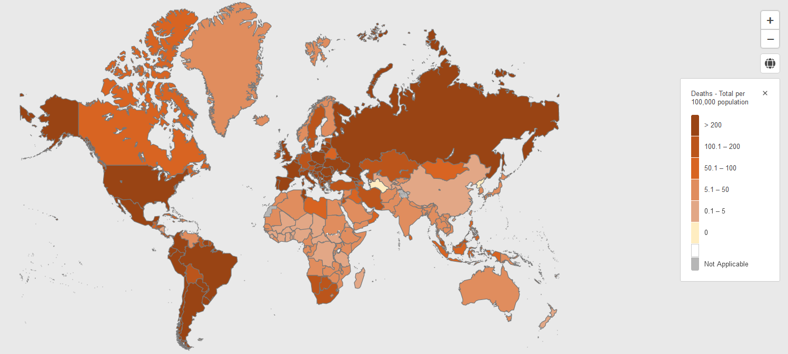
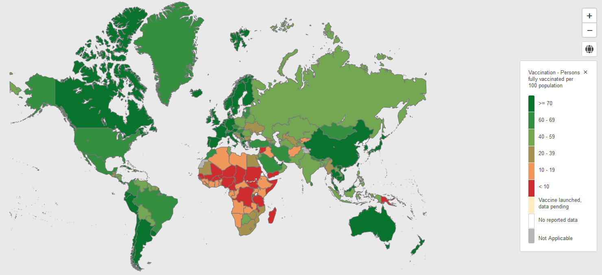

```{r setup, include=FALSE}
knitr::opts_chunk$set(echo = TRUE)
library(tidyverse)
library(readxl)
library(ggpubr)
library(ggforce)
library(htmltab)
```


```{r, echo=F, results='hide', message=F, warning=F}
covid <- read_csv("state_covid_deaths.csv")

#Only considering dates later than 11/20/2021 to examine Omicron
covid$submission_date <- as.Date(covid$submission_date, format="%m/%d/%Y")
covid_df <- covid %>% filter(submission_date >= as.Date("2021-11-20"))
covid_df <- covid_df %>% group_by(state) %>% summarise(deaths_since_1120 = sum(new_death))
names(covid_df)[1] <- "Code"


#Loading in additional variables
abbr <- read_csv("abbr.csv")
obesity <- read_csv("2020obesity.csv")
elderly <- read_csv("2020pct65+.csv")
vaccine <- read_excel("covid19_vac.csv.xlsx")
income <- read_csv("medianincome.csv")
urban <- read_excel("urban.xls")
pop <- read_excel("state-census-counts-2020.xlsx")
hospital <- read_csv("hospitalbeds.csv")
masks <- read_csv("maskmandate.csv")
vaccination <- read_csv("COVID-19_Vaccinations_in_the_United_States_Jurisdiction.csv")
vac_preomi <- vaccination %>% filter(Date == as.Date("06/01/2021"))
vac_1120 <- vaccination %>% filter(Date == "11/20/2021")
names(vac_preomi)[3] <- "Code"
names(vac_preomi)[39] <- "Vac_Rate_18_preomi"
names(vac_1120)[3] <- "Code"
names(vac_1120)[39] <- "Vac_Rate_18_1120"

covid_1120_cases <- covid %>% filter(submission_date >= as.Date("2021-11-20")) %>% group_by(state) %>% summarise(cases_since_1120 = sum(new_case))
names(covid_1120_cases)[1] <- "Code"
covid_1120_cases <- merge(covid_1120_cases, abbr[c(1,3)], by = "Code")


names(vaccine)[1] <- "State"


#Creating post vax, pre omi death data
covid_preomi <- covid %>% filter(submission_date < as.Date("2021-11-20") & submission_date >= as.Date("2020-12-14"))
covid_preomi_deaths <- covid_preomi %>% group_by(state) %>% summarise(pre_omi_deaths = sum(new_death))
covid_preomi_cases <- covid_preomi %>% group_by(state) %>% summarise(pre_omi_cases = sum(new_case))
names(covid_preomi_deaths)[1] <- "Code"
covid_preomi_deaths <- merge(covid_preomi_deaths, abbr[c(1,3)], by = "Code")
names(covid_preomi_cases)[1] <- "Code"
covid_preomi_cases <- merge(covid_preomi_cases, abbr[c(1,3)], by = "Code")

#Cumulative cases
cumcases_preomi <- covid %>% filter(submission_date <= as.Date("2020-12-14")) %>% group_by(state) %>% summarise(cum_cases_1214 = sum(new_case))
cumcases_1120 <- covid %>% filter(submission_date <= as.Date("2021-11-20")) %>% group_by(state) %>% summarise(cum_cases_1120 = sum(new_case))
names(cumcases_preomi)[1] <- "Code"
names(cumcases_1120)[1] <- "Code"


#Merging data
covid_df <- merge(covid_df, abbr[c(1,3)], by = "Code")
covid_df <- merge(covid_df, obesity[-3], by = "State")
names(covid_df)[4] <-  "obesity"
covid_df <- merge(covid_df, elderly[c(2,5)], by = "State")
covid_df <- merge(covid_df, vaccine[c(1,16,75)], by = "State")
covid_df <- merge(covid_df, income, by = "State")
covid_df <- merge(covid_df, urban[c(2,14)], by = "State")
covid_df <- merge(covid_df, pop[c(1,14)], by = "State")
covid_df <- merge(covid_df, covid_1120_cases[-1], by="State")
covid_df <- merge(covid_df, covid_preomi_cases[-1], by="State")
covid_df <- merge(covid_df, covid_preomi_deaths[-1], by="State")
covid_df <- merge(covid_df, hospital, by="State")
covid_df <- merge(covid_df, masks, by="State")
covid_df <- merge(covid_df, cumcases_preomi, by="Code")
covid_df <- merge(covid_df, cumcases_1120, by="Code")
covid_df <- merge(covid_df, vac_1120[c(3,39)], by="Code")
covid_df <- merge(covid_df, vac_preomi[c(3,39)], by="Code")


names(covid_df)[9] <- "urban"
names(covid_df)[10] <- "pop_2020"
names(covid_df)[5] <- "pct_gtr65"
names(covid_df)[6] <- "pct_full_vax18"
names(covid_df)[7] <- "pct_full_vax_with_booster"
covid_df$pct_full_vax18 <- as.double(covid_df$pct_full_vax18)
covid_df$pct_full_vax_with_booster <- as.double(covid_df$pct_full_vax_with_booster)
covid_df$deaths_per_100k_1120 <- covid_df$deaths_since_1120 / covid_df$pop_2020 * 100000
covid_df$deaths_per_100k_preomi <- covid_df$pre_omi_deaths / covid_df$pop_2020 * 100000
covid_df$case_mortality_1120 <- covid_df$deaths_since_1120 / covid_df$cases_since_1120
covid_df$case_mortality_preomi <- covid_df$pre_omi_deaths / covid_df$pre_omi_cases
covid_df$pct_booster <- covid_df$pct_full_vax18 * covid_df$pct_full_vax_with_booster / 100
covid_df$cum_cases_rate_1120 <- covid_df$cum_cases_1120 / covid_df$pop_2020 * 100
covid_df$cum_cases_rate_preomi <- covid_df$cum_cases_1214 / covid_df$pop_2020 * 100
```


---

## Introduction

### a) COVID-19 Background


First discovered on December 12th, 2019 in Wuhan, China, COVID-19 has spread into a major worldwide pandemic. Due to its highly infectious nature, where droplets from infected individuals are spread through the air, COVID-19 has been unsuccessfully contained by governments around the world. Symptoms of COVID-19 include coughs, shortness of breath, fevers, congestion, loss of smell, and more. Severe cases of COVID-19 lead to respiratory dysfunction and other organ failure. In the past two years, there have been over 400 million confirmed cases of COVID-19 which has led to nearly 6 million deaths. In the United States alone, there have been nearly 80 million confirmed cases and nearly 1 millions confirmed deaths. 


Vaccination against COVID-19 was first available to the United States general public on December 11th, 2020. Since their introduction, vaccines have become a major public health strategy to reduce the spread and mortality from COVID-19. As of February 2022, over 80% of the US population over 5 years of age has had a least one vaccination dose, 69% of the same group with full vaccination, and 45% of the US population over 12 years with full vaccination and a booster shot. Through clinical trials and analyses of COVID-19 cases and deaths, vaccination has been shown to be an effective measure against COVID-19. However, with newer variants, like the recent Omicron variant, the efficacy of vaccines is less of a sure thing now.


### b) Introduction of Dataset and Problems of Interest


In this project, we will be working with United States state-by-state COVID-19 case, death, and vaccination data from the CDC. In addition to this data, we have collected a number of covariate measures as control variables. These include obesity rate, percentage of elderly population, median household income, urbanization rate, percentage of days with mask mandate, and hospital beds per 1000. There are reasons why we include these covariates as control variables. Numerous sources have confirmed that obese patients suffer more severe COVID-19 infections. Similarly, around 74% of COVID-19 deaths in the United States were people 65 years and older. Median household income of a state will serve as a proxy for socioeconomic status to afford healthcare. Urbanization rate will account for population density and spread of the disease. Percentage of days with mask mandate will capture restrictive measures to combat COVID-19. Finally, hospital beds capacity per 1000 will capture some of a state's healthcare capabilities. We will not consider controlling for the type of vaccine distributed in each state since we will assume relative uniformity in vaccine type used across states. Controlling for these variables across states can isolate the effect of vaccination rates on COVID-19 mortality rates.


Our main question of interest is whether a high vaccination rate corresponds with lower overall mortality rates from COVID-19's Omicron variant. In addition to this question, we will also examine the herd immunity aspect of COVID-19 immunity by examining whether cumulative cases rates correspond to lower Omicron death rates. We will take the vaccination rate and cumulative cases rate before the Omicron period as our figure. We do not consider booster vaccination rate on Omicron death rates since booster data is too recent and many people are not yet eligible for a booster shot yet which complicates analysis. We are interested in this question because it envelopes a number of important issues. This will help us understand if Omicron has vaccine resistance compared to earlier variants. This will also help us understand how much vaccines decrease in efficacy over time. Finally, this can also inform states of possible public health policies moving forward. We can try to produce information on if states should prioritize vaccination moving forward in light of vaccine resistant variants, or if states need to take other measures. To compare this result we will also examine the same efficacy of vaccines and cumulative cases on death rates in the period after vaccinations were available, but before the Omicron variant. 


### c) Causal Inference Feasibility


We are only examining associations since some assumptions of the potential outcomes framework are violated. Namely, the covariates between each state are likely not independent. For example, for elderly percentage and obesity rate, since people can move in between states the values within states are likely dependent on each other. Additionally, there are likely unobserved confounding variables that mean that we cannot extract causal effects due to the violation of the ignorability assumption. For example, we do not have good data on the amount of unreported cases and how this missing data could differ between states. This complicates modelling concerned with cumulative case rates as protection from Omicron. However, the more controlled environment of clinical trials related to vaccines will derive causal statements that we can refer to.


---

## Exploratory Analysis


### a) WHO COVID-19 Data Initial Analysis


```{r, echo=F, results='hide', message=F, warning=F}
who_covid <- read_csv("https://covid19.who.int/WHO-COVID-19-global-data.csv")
who_vac <- read_csv("https://covid19.who.int/who-data/vaccination-data.csv")

who_covid_latest <- who_covid %>% filter(Date_reported >= as.Date("2020-12-01")) %>% group_by(Country) %>% summarise(cases_since_1220 = sum(New_cases))
names(who_covid_latest)[1] <- "COUNTRY"

who_dat <- merge(who_covid_latest, who_vac, by="COUNTRY")

pop_url <- "https://en.wikipedia.org/wiki/List_of_countries_and_dependencies_by_population"
world_pop <- htmltab(pop_url, which = 1) %>% as_tibble %>%
  mutate(population = as.numeric(gsub(",", "",Population)), COUNTRY =`Country / Dependency`)
world_pop <- world_pop %>% mutate(COUNTRY = substr(COUNTRY,3, 1000000L))

who_dat <- merge(who_dat, world_pop[c("population", "COUNTRY")], by="COUNTRY")
who_dat$deaths_per100 <- who_dat$cases_since_1220 / who_dat$population * 100
```


More broadly, we are interested in how vaccination rates are associated with Omicron death rates in general, which includes on a worldwide scale. The WHO COVID-19 Dashboard contains ample information related to COVID-19 death and vaccination rates on a global scale.


From the maps below, we can notice that many major developed countries have high COVID-19 vaccination rates. In contrast, there is a noticeable lack of COVID-19 vaccination in Africa, but the death rates to COVID-19 are also relatively low.






We further investigate this observation by plotting the deaths-per-100 population after December 1st, 2020, a rough benchmark of when vaccines were first administered. From this plot, we can actually notice a positive association between vaccination rates and death rates which makes sense since countries experiencing more severe COVID-19 cases will be more likely to push vaccination policies. The correlation coefficient between these two variables is a moderate positive one of 0.538.


```{r, echo=F}
ggplot(who_dat, aes(x=PERSONS_FULLY_VACCINATED_PER100,y=deaths_per100)) + geom_point() + labs(title="COVID-19 vaccination rate against death rate") + xlab("People fully vaccinated per 100") + ylab("Post 12/01/20 deaths per 100")

#cor(who_dat$PERSONS_FULLY_VACCINATED_PER100, who_dat$deaths_per100)
```


There are difficulties with analyzing vaccine efficacy worldwide, however. First, there is a lack of uniformity worldwide on vaccine types used. Different countries use different vaccine types. Next, omicron affected different countries at different times which means examining the Omicron variant specifically will require different time periods for each country. For these reasons, we believe that looking specifically at United States data will control more for these differences and allow for more comparison.


### b) USA state-by-state exploratory analysis


We now conduct some exploratory analysis on the USA state-by-state data. First, we will examine key COVID-19 summary statistics like number of cases, number of deaths, case-mortality rate, deaths per 100,000 total population, and percentage of people over 18 years old who are fully vaccinated. Our data are collected on the state level. We will compare these measures in the post-vaccination, but pre-Omicron period (12/14/2020-11/19/2021) to the post-Omicron period (11/20/21-2/25/2022).


```{r, echo=F, eval=F}
sum(covid_df$deaths_since_1120)
sum(covid_df$cases_since_1120)
sum(covid_df$deaths_since_1120) / sum(covid_df$cases_since_1120) * 100

sum(covid_df$pre_omi_deaths)
sum(covid_df$pre_omi_cases)
sum(covid_df$pre_omi_deaths) / sum(covid_df$pre_omi_cases) * 100
```


From the table below, we can see that the number of cases in the two periods are very close despite the pre-Omicron period being several months longer. This suggests that Omicron may be even more contagious. We can also note that the omicron case-mortality rate is much lower, which signifies possibly less severity for Omicron infections.


Table: Cases, Deaths, and Case-Mortality Rates

| Time Period        | 12/14/2020-11/19/2021    | 11/20/21-3/10/2022 |
|:-------------------|--------------------------|-------------------:|
|Total Covid Cases   | 29,887,293               | 30,033,988         |
|Total Covid Deaths  | 436,820                  | 177,549            |
|Case-Mortality Rate | 1.461%                   | 0.591%             |


This information is not enough for us to determine vaccination efficacy against the Omicron variant, so we now examine some summary statistics and distributions of our variables of interest like over age 18 vaccination rate and our other covariates. Note that we chose over age 18 vaccination rate rather than overall vaccination rate since children have a miniscule likelihood of dying to COVID-19. We chose full vaccination status over partial vaccination status because the vaccines were intended to have full doses for full effectiveness.


From the pairwise scatter plots and correlation matrix below, we can see that there is no obvious nonlinearity between COVID-19 death rate and our predictor measures which suggests suitability of a linear model. Omicron death rate seems to have small to moderate correlations with our covariates in the model. Notice that omicron death rates do have a negative correlation with vaccination rate which is the effect that we expect, but this relationship is not very strong. For cumulative cases rate, there is actually a small positive association with omicron death rates which is not what we would expect if past infections protect against Omicron. Finally, we can also notice that there are some moderate correlations between our covariates like a -0.69 correlation between obesity rate and vaccination rate, a 0.69 correlation between median income and vaccination rate, and a -0.68 correlation between cumulative cases rate and vaccination rate. These correlations could present multicollinearity problems when fitting the model so we will run the diagnostics after fitting the model to see if this affects our analysis.


```{r, echo=F}
var_of_interest <- c("deaths_per_100k_1120", "Vac_Rate_18_1120", "obesity", "pct_gtr65", "HouseholdIncome", "urban", "HbedsPer1000", "OmiPctMaskMandate", "cum_cases_rate_1120")

panel_cor <- function(x,y) {
  par(usr = c(0, 1, 0, 1))
  r <- round(cor(x, y, use = "complete.obs"), 2)
  txt <- paste0("R = ", r)
  cex_cor <- 0.8/strwidth(txt)
  text(0.5, 0.5, txt, cex = cex_cor)
}

pairs(covid_df[var_of_interest],
      lower.panel = panel_cor, cex.labels = 0.8, labels = c("Omi DP100k","18+ Vac Rate","Obesity Rate","Elderly Pct","Med Income","Urban Rate", "Hosp. Beds", "Pct Days Mask", "Cases Rate"))
```


Next, we will examine the histograms for state death rates from omicron and pre-Omicron post-vaccination periods. We can see that omicron death rates definitely tend lower, and that both distributions are relatively symmetric about their means. Since these distributions are not too pathological then we should be fine conducting analyses with them.


```{r, echo=F}
ggplot(covid_df) + geom_histogram(bins=18, aes(x=deaths_per_100k_1120, fill="Omicron Death Rates")) + 
  geom_histogram(bins=18, aes(x=deaths_per_100k_preomi, fill="Pre-Omicron Death Rates")) +  
  guides(fill=guide_legend(title="Period")) +
  labs(title="Histogram of COVID-19 deaths-per-100,000 by state") + xlab("Deaths-per-100,000") + ylab("Count")
```


Finally, we will display some histograms for our covariate variables. We can see some descriptive results like vaccination rates have a mean of 68.85%, but there are clusters of states with lower rates around 60%. Cumulative cases rate until 11/20/21 has a mean of 14.5% and a left-skewed distribution. For obesity rate, states have an average of 32.21%, with higher states in the high 30%'s and lower ones in the high 20%'s. For percent of population over 65, states tend to center pretty tightly around the mean value of 17.42%. For median household income there is a mean of 62.6 thousand dollars a year and the distribution is a bit right skewed. For urbanization rate, there is a mean of 73.59% and the distribution is a bit left skewed. Percent of days with mask mandate during the omicron period is heavy right skewed right most values at 0%. Finally, hospital beds per 1000 has a mean of 2.56 and a small right skew. Overall, these distributions are mostly not too extreme which means that there should not be too many problems in later analysis.


```{r, message=F, warning=F, echo=F}
hist1 <- ggplot(data=covid_df, aes(x=Vac_Rate_18_1120)) + geom_histogram(fill="red",bins=20) + labs(title="") + xlab("Over 18 Full Vaccination Rate")

hist2 <- ggplot(data=covid_df, aes(x=cum_cases_rate_1120)) + geom_histogram(fill="pink",bins=20) + labs(title="") + xlab("Cum. Cases Rate")

hist3 <- ggplot(data=covid_df, aes(x=obesity)) + geom_histogram(fill="blue",bins=20) + labs(title="") + xlab("Obesity Rate")

hist4 <- ggplot(data=covid_df, aes(x=pct_gtr65)) + geom_histogram(fill="purple",bins=20) + labs(title="") + xlab("Percent of Population over 65")

hist5 <- ggplot(data=covid_df, aes(x=HouseholdIncome)) + geom_histogram(fill="green",bins=20) + labs(title="") + xlab("Median Household Income")

hist6 <- ggplot(data=covid_df, aes(x=urban)) + geom_histogram(fill="orange",bins=20) + labs(title="") + xlab("Urbanization Rate")

hist7 <- ggplot(data=covid_df, aes(x=OmiPctMaskMandate)) + geom_histogram(fill="seagreen",bins=20) + labs(title="") + xlab("% of days with mask mandate")

hist8 <- ggplot(data=covid_df, aes(x=HbedsPer1000)) + geom_histogram(fill="gray",bins=20) + labs(title="") + xlab("Hospital beds per 1000")

#summary(covid_df)
hists <- ggarrange(hist1,hist2,hist3,hist4,hist5,hist6,hist7,hist8,nrow=3,ncol=3,common.legend=T,legend="bottom")
annotate_figure(hists, top="Histograms of state-wide covariates")
```


---


## Proposed Model: Multiple Linear Regression
      
      
To answer our question of interest, we propose a multiple linear regression model:

$$Y_i = \beta_0 + \sum_{j=1}^{8}\beta_jX_{ji} + \epsilon_i, \textbf{ } i=1,...,50$$
$$\epsilon_{i} \stackrel{iid} \sim N(0,\sigma^2) $$
Here, $Y_i$ represents the Omicron-period deaths-per-100,000 for the i'th state. $\beta_0$ represents the population intercept term, $\beta_1$ through $\beta_8$ represent the population regression coefficients for over 18 full vaccination rate, cumulative cases rate, obesity rate, over age 65 percentage of population, median household income, percent of days with mask mandate, hospital beds per 1000 and urbanization rate repectively. $X_{1i}$ through $X_{8i}$ represent the values of the same five variables before for the i'th state. $\epsilon_i$ represents the unobserved error terms.


This model implicity assumes a linear relationship between our covariates and the outcome variable Omicron-period deaths-per-100,000 by state. The main assumptions are on the error terms. We assume that they are independent and identically normally distributed with zero mean and constant variance.


We can examine the efficacy of vaccination rates and cumulative cases for herd immunity on state-wide Omicron deaths-per-100,000 by looking at the magnitude and significance level of the regression coefficient for vaccination rate. Since we have control variables in the model, we are able to get more of the effect of vaccination rate and prior infection holding those other variables constant. We can examine the suitability of linearity and if there is not real deviation, then this model allows us to see if there how deaths rate changes with vaccination rate, and if there is a statistically significant effect.


---


## Results from Model


```{r, echo=F}
fit1 <- lm(deaths_per_100k_1120 ~ Vac_Rate_18_1120 + obesity + pct_gtr65 + HouseholdIncome + urban + OmiPctMaskMandate + cum_cases_rate_1120 + HbedsPer1000, data=covid_df)
#pander::pander(fit1)
#summary(fit1)
```

### a) Omicron period model fit


From fitting this linear model we get the results below. The p-values correspond to the test of:


$$ H_0 : \beta_i = 0 \textbf{ vs } H_a: \beta_i \neq 0, \textbf{ } i=1,2,...,6 $$

This tests for non-zero regression coefficients which correspond to a statistically significant linear association.


From the table below, we can see that only one of the coefficients, the one associated with proportion of population over 65 years old is significant at significance level 0.05. For vaccination rate which we are specifically interested in, the coefficient is not even marginally significant, but the coefficient is negative which is what we would expect. For cumulative cases rate, we actually observe a positive coefficient with a very insignificant test result which also suggests that prior COVID-19 infections were not associated with Omicron death rates. Without a significant result we cannot say that state-wide vaccination rate and prior-infections correspond to lower state-wide omicron deaths-per-100,000. Before further analysis of this result, we also examine the result when fitting the same model to the 12/14/2020-11/19/2021 period.


Table: Linear model of omicron deaths-per-100,000 with vaccination rate, cumulative case rate, and control variables

------------------------------------------------------------------------
         &nbsp;             Estimate    Std. Error   t value   Pr(>|t|) 
------------------------- ------------ ------------ --------- ----------
     **(Intercept)**         -55.27       64.69      -0.8544    0.3978  

**Vaccination Rate**        -0.2786       0.4376     -0.6367    0.5278  

**Obesity Rate**            1.133        0.8036      1.41      0.1662  

**Pop Proportion 65+**       4.499        1.338       3.363    0.001681 

   **Median Income**      -0.0002828   0.0003508    -0.8062    0.4248  

 **Urbanization Rate**      0.3888       0.2168      1.793    0.08033  

**% Days Mask Mand.**       -10.39       7.551      -1.376     0.1762  

**Cum. Cases Rate**        0.8787       0.9894     0.8882     0.3796  

 **Hosp. Beds/1000**         -2.054       4.162      -0.4936    0.6243  
------------------------------------------------------------------------


### b) Pre-omicron period model fit


To allow for more comparability between the omicron period and the post-vaccine pre-omicron period we include the covariates of cumulative cases rate and percentage of days with mask mandate. The cumulative cases rate should capture the differing level of achieved herd immunity at each time period. This cumulative cases rate is calculated for the beginning of each period. The percentage of days with mask mandate should capture the difference in COVID-19 restriction policies during the two periods. The earlier period had more stringent measures, while the omicron period has less stringent measures. Finally, we take the vaccination rate as of 6/1/2021 for this pre-Omicron period as a representative measure of the vaccination rate over the period. At the beginning of this period we will have lost data since not many people have had vaccinations yet, but COVID-19 deaths will rise, so we take the midpoint vaccination rate as a compromise.


Fitting this same model, but on the pre-omicron period, we now observe a very significant result at significance level 0.05 for vaccination rate. The magnitude of the coefficient is larger here at -2.646 vs -0.1563 for the omicron period. This can be interpreted as holding the other control variables constant, a one-percentage point increase in vaccination rate will lead to a decrease of 2.646 COVID-19 deaths-per-100,000. Do note that this only applies within the range of the vaccination rate data so we should not extrapolate this result. It is likely that for lower vaccination rates the difference may be more profound since it increases the population to herd immunity.


We also notice that elderly population proportion and urbanization rate are also both significant at level 0.05 which means that including them in the model makes sense if we want to interpret only vaccination rate's effect. However, again, cumulative cases rate has a very small, but even positive association with death rates and an insignificant coefficient. This suggests that prior infections are not associated with lower death rates. This may be because later deaths are caused by different variants where past infections do not provide adequate immunity. It may also suggest that immunity from past infections is only temporary. Additionally, past infection may just not provide strong immunity to COVID-19.


```{r, echo=F, eval=F}
fit2 <- lm(deaths_per_100k_preomi ~ Vac_Rate_18_preomi + obesity + pct_gtr65 + HouseholdIncome + urban + PreomiPctMaskMandate + cum_cases_rate_preomi + HbedsPer1000, data=covid_df)

#summary(fit2)
#pander::pander(fit2)
```


--------------------------------------------------------------------------
          &nbsp;             Estimate    Std. Error   t value    Pr(>|t|) 
--------------------------- ----------- ------------ ---------- ----------
      **(Intercept)**          76.05        110        0.6915     0.4931  

**Vaccination Rate**          -2.646       0.9141      -2.895    0.006057 

**Obesity Rate**              2.209       1.565       1.411      0.1657  

**Pop Proportion 65+**        6.449       2.996       2.152     0.03731  

    **Median Income**       -0.001292   0.0007872     -1.641     0.1084  

 **Urbanization Rate**         1.208       0.4501      2.685     0.01042  

**% Days Mask Mand.**        -7.189        17.8      -0.4039     0.6884  

**Cum. Cases Rate**         0.02731       3.29      0.008303    0.9934  

 **Hosp. Beds/1000**         -0.5085      9.551      -0.05324    0.9578  
--------------------------------------------------------------------------

Table: Linear model of pre-omicron/post-vaccination deaths-per-100,000 with vaccination rate, cumulative cases rate, and control variables


The differences in the t-tests of the vaccination rate coefficient in these two models suggests that vaccines likely did perform better against previous variants as opposed to Omicron. This is not too surprising since those vaccines were developed for older variants, but the lack of significant association for between vaccination rate and omicron does raise concern for future policy measures. This may suggest Omicron vaccine resistance, but it may also suggest a decrease of vaccine effectiveness over time. 

---

## Model Diagnostics 


Now, we conduct some model diagnostics on the main omicron deaths model to examine if there are any deviations from our model assumptions. From the plots below, we can see that there is no clear nonlinearity or heteroscedasticity in the residuals which suggests that the implicit assumption of linearity holds and the explicit assumption of constant error variance holds.


From the Normal Q-Q plot, we can see some deviations from normality by the residuals at the tail values, but these deviations do not seem very strong.


We can also conduct some formal tests to examine our assumptions. To test normality, we conduct a Kolmogorov-Smirnov test on our residuals. The null hypothesis for this test is that the residuals are drawn from a normal distribution, and the alternative hypothesis is that they are not. From this test, we obtain a p-value of 0.9929 which is very insignificant which suggests that the normality of the residuals is suitable.


To test the homoscedasticity assumption, we can use a Breusch-Pagan test which has a null hypothesis that the error variance is constant versus an alternative hypothesis that the error variance is not constant. When performing this test, we get a p-value of 0.002 which is significant at significance level 0.05. This means that we reject the null hypothesis which means there may be non-constant variance of the error terms. However, from the residuals plot there does not seem to be huge issues except for one outlier so we will still assume the validity of our assumptions.


```{r, echo=F}
par(mfrow=c(1,2))
plot(fit1, which=c(1,2))
```

```{r,echo=F,eval=F}
olsrr::ols_test_breusch_pagan(fit1)
olsrr::ols_test_f(fit1)
olsrr::ols_test_normality(fit1)
car::vif(fit1)
car::boxCox(fit1)
```


Finally, we also compute the variance inflation factors (VIF) of our model covariates. VIF estimates the amount that the variances of the coefficients are inflated by being fit together. This will reveal if there is any strong multicollinearity in the model. If there is strong multicollinearity, the lack of a significant result in the omicron model may be due just to that. From the table below, we can see that there is some multicollinearity especially with vaccination rates, median household incomes, obesity rates, and cumulative case rates. These VIF values are not too high, but they still may affect our final inference. However, from our earlier exploratory analysis, we did already see that for omicron death rates and vaccination, the scatter plot relationship was not too strong anyways. Furthermore, the estimated value of vaccination rate's coefficient is not very high. Considering these factors, we decide to accept the result that vaccination rate is less effective in reducing omicron death rates state-wide.


Table: Variance Inflation Factors of Covariates

| Time Period        | VIF                      |
|:-------------------|-------------------------:|
|Vaccination Rate    | 3.18                     |
|Obesity Rate        | 2.43                     |
|Pop Proportion 65+  | 1.62                     |
|Median Income       | 3.08                     |
|Urbanization Rate   | 2.37                     |
|Pct. Mask Mandate   | 1.73                     |
|Cum. Case Rate      | 2.64                     |
|Hosp. Beds Per 1000 | 1.95                     |

---

## Interpretation of Results


### a) Interpretation


We now go into deeper interpretations of our results and the implication of these results. Our results suggest that on a state level, vaccination rates and cumulative case rates are not significantly associated with lowered death rates from the omicron variant of COVID-19. This suggests that from an immunization standpoint, Omicron should be treated as mostly a new virus. As we can see from the plot below, most states have an estimated immunized proportion of population over 80% which is higher than the estimated 70% needed for herd immunity that experts suggest. Note that this proportion may be an overestimate since it does not account for the people who have been infected and vaccinated, but since it also only counts official COVID-19 cases it underestimates that factor.

```{r, }
ggplot(covid_df,aes(x=Vac_Rate_18_1120+cum_cases_rate_1120)) + geom_histogram(bins=20, fill="green") + labs(title="Sum of vaccination rate and cumulative cases rate as proxy for immune population") + xlab("Vaccination rate + cumulative cases rate") + ylab("Count")
```


We can look to what some studies say on vaccination and past infection efficacy on Omicron infection. From a study conducted in Qatar, researchers estimate a 95% confidence interval of (50.6%, 60.9%) for past infection protection against re-infection by Omicron. Furthermore, they also estimate an 87.8% protection by past infection against severe Omicron cases. However, an Imperial College London report estimated that the protection of past infection against Omicron may be as low as 19%. What these estimates suggest is that Omicron is more resistant to antibodies provided by past COVID-19 infection, but the extent is not quite known. We do find that past infection measured by cumulative case rate at the beginning of the period was not significant in predicting lower death rates to Omicron, but our coefficient was actually positive. This raises some concern and it suggests inaccuracies related to using state-wide data to estimate outcomes. Also, since many cases are not reported, official cases may inaccurately represent true cases. Furthermore, we do not go into a detailed look at the specific population of people with past infections and track their outcomes because we lack that data.


To allow for comparability between the pre-Omicron and Omicron periods, we include some control variables to balance out the differences between the periods. This hopefully makes the main difference, the dominant variant of each period, more isolated. Comparing the two regressions, we find a very significant result for vaccinations on lowered death rates in the pre-Omicron period, but an insignificant result in the Omicron period. This provides a sanity check that state level data does not mess up the results that we expect. For Delta and previous variants, which the vaccines were developed for, there does seem to be strong association between vaccination rates and lowered death rates. However, even in the pre-Omicron period regression, we find that cumulative case rate has an insignificant association with lowered death rates. Again, the coefficient is even slightly positive which is not what we would expect.


Now, in the vaccination case, there are also some studies that estimate vaccination efficacy on preventing severe Omicron variant cases. Lab results at the University of Nottingham found that Pfizer's vaccine saw a 40-times reduction in neutralising antibodies against Omicron. However, a study by the NIH found that although Omicron evaded vaccines in infection, the 80% preservation of T cell antibodies should protect against severe infection. This goes against our findings so further investigation would be needed to confirm the interaction of vaccines and the Omicron variant.


Finally, another factor to consider is also the weakening of vaccines over time. A study published in *Emerging Microbes and Infections* finds that antibodies decline with a 55 day half-life in seronegative patients and an 80 day half-life in seropostive patients. The figure below tracks the estimates of antibodies in patients after vaccination. Note how there is a decrease in antibodies. This suggests that the Omicron period may also see a non-significant association of vaccination rate with death rates because of weakening vaccines over time too.


### b) Caveats of Analysis


First, since we look at state level data to simplify the analysis, we lose a more detailed look at Omicron's mechanisms against prior immunization methods. More detailed studies on a smaller population of specific individuals with prior infections and vaccinations that track more data like time since vaccination will provide better insights into the mechanisms behind these factors. Furthermore, by condensing our data into a sum over a time period, we lose more detailed data on vaccination rates and cases changes during the time period. Also, the Omicron variant is still active during this study so we have incomplete data on the full extent of the Omicron outbreak in the United States.


Another caveat is in the model itself. It models death rates as a linear function of vaccination rates and cumulative cases rates, but in reality we should expect some sort of diminishing returns as a population reaches herd immunity. From the model diagnostics, we see that within the range of the data of these vaccination rate and cumulative case rate the linear relationship seems reasonable. We also note no strong deviations from linearity in the analysis of the residuals. However, it is more likely that this relationship is only piecewise approximately linear. To more fully model the full range of vaccination rate and cumulative case rate we would likely need to have a wider range of data and we would likely need to consider some sort of logarithmic relationship.


Another small caveat is in the covariates. We believe that they capture a decent amount of relevant factors related to COVID-19 deathrates, but there can be improvements. For example, more detailed data on ICU occupancy or health care capabilities during the specific time periods may better capture how states can handle COVID-19 outbreaks. We also do not consider booster shot outcomes since they are too recent to have adequate data on. The booster shots may be an answer, but we cannot address that at this time.


Finally, this study only deals with associations. The questions we ask we would clearly like to be causal in nature, but due to the data that we have and the likely dependencies of our covariates between states we do not meet the assumptions for causal inference on observational data.


---

## Conclusion and Further Areas for Research


From the results of this analysis, we conclude that vaccination and prior infection does not have a statistically significant association with Omicron deaths-per-100,000 when in the model with a number of control variables. Fitting the same model, but with post-vaccine and pre-Omicron deaths-per-100,000 we get a very significant association of vaccination data with lower death rates, but no significant result for prior infections. This suggests that vaccines are effective at preventing COVID-19 deaths, but against omicron they are less effective. Their effect is low enough that we cannot fully say if a high vaccination rate is associated with significant reductions in a state's Omicron death rate. This can be due to vaccine adaptations by the new variant, but also to weakening vaccine effectiveness over time.


With this, there are possible directions for further research. Further research can take a more detailed look at how vaccines interact with Omicron and similar new variants like omicron. It can also research the length of vaccine efficacy and it can research how much protection booster shots provide to newer variants. For example, a report by the UK Health Security Agency found that a third shot reduced hospitalization from Omicron by 92%. However, this dropped to 83% only 10 weeks after the booster shot. So the jury is still out on the viability of booster shots as a long term solution. This information can better inform states of which measures they should take in response to newer COVID-19 variants since they likely cannot solely rely on old vaccines.


This research then suggests that reliance on past variant vaccinations and infections will likely not provide adequate protection against future variants if they exhibit the same resistance that Omicron does. This is a concerning finding that means that COVID-19 may not end from policy measures, but rather from just a weakened endemic form if it continues to mutate. The booster shots and future vaccines do offer possible solutions for future COVID-19 variants, but there are difficulties with these approaches. The population would likely not be happy with bi-annual booster shots for the long term. For future vaccines there is the difficulty of predicting the protein spike structure of future variants and of developing new vaccines.


\newpage

## References

https://covid.cdc.gov/covid-data-tracker/#datatracker-home (COVID-19 Cases)

https://www.cdc.gov/coronavirus/2019-ncov/symptoms-testing/symptoms.html (Symptoms of COVID-19)

https://www.cdc.gov/museum/timeline/covid19.html#:~:text=December%2012%2C%202019%20A,of%20breath%20and%20fever.(COVID-19 Timeline)

https://www.cdc.gov/nchs/nvss/vsrr/covid_weekly/index.htm (COVID Deaths by Age Group)

https://www.fda.gov/news-events/press-announcements/fda-approves-first-covid-19-vaccine (First USA COVID Vaccine)

https://www.science.org/content/article/why-covid-19-more-deadly-people-obesity-even-if-theyre-young (COVID and Obesity)

https://stateofchildhoodobesity.org/adult-obesity/ (Obesity Rates)

https://www.prb.org/resources/which-us-states-are-the-oldest/ (Elderly Population)

https://worldpopulationreview.com/state-rankings/median-household-income-by-state (Median Household Income)

https://www.icip.iastate.edu/tables/population/urban-pct-states (Urbanization Rates)

https://www.census.gov/quickfacts/fact/table/US/PST045221 (USA Population)

https://covid.cdc.gov/covid-data-tracker/#vaccinations_vacc-total-admin-rate-total (COVID Vaccine Data)

https://ballotpedia.org/State-level_mask_requirements_in_response_to_the_coronavirus_(COVID-19)_pandemic,_2020-2022 (State Mask Mandate Data)

https://www.beckershospitalreview.com/rankings-and-ratings/states-ranked-by-hospital-beds-per-1-000-population-2.html (Hospital Beds Data)

https://covid19.who.int/ (WHO COVID-19 Dashboard)

https://pubmed.ncbi.nlm.nih.gov/34232116/ (Antibody decline)

https://www.mayoclinic.org/diseases-conditions/coronavirus/in-depth/herd-immunity-and-coronavirus/art-20486808 (Herd immunity estimates)

https://www.nejm.org/doi/full/10.1056/NEJMc2200133 (Omicron past infection protection)

https://www.imperial.ac.uk/news/232698/omicron-largely-evades-immunity-from-past/ (ICL Omicron re-infection)

https://www.bmj.com/content/375/bmj.n3062 (Pfizer weaker against omicron)

https://www.nih.gov/news-events/nih-research-matters/covid-19-vaccines-induce-immune-response-omicron (Omicron T cells)

https://www.nature.com/articles/d41586-022-00199-z (Booster shots and Omicron)

\newpage


## Code Appendix

```{r ref.label=knitr::all_labels(), echo=TRUE, eval=FALSE}

```


